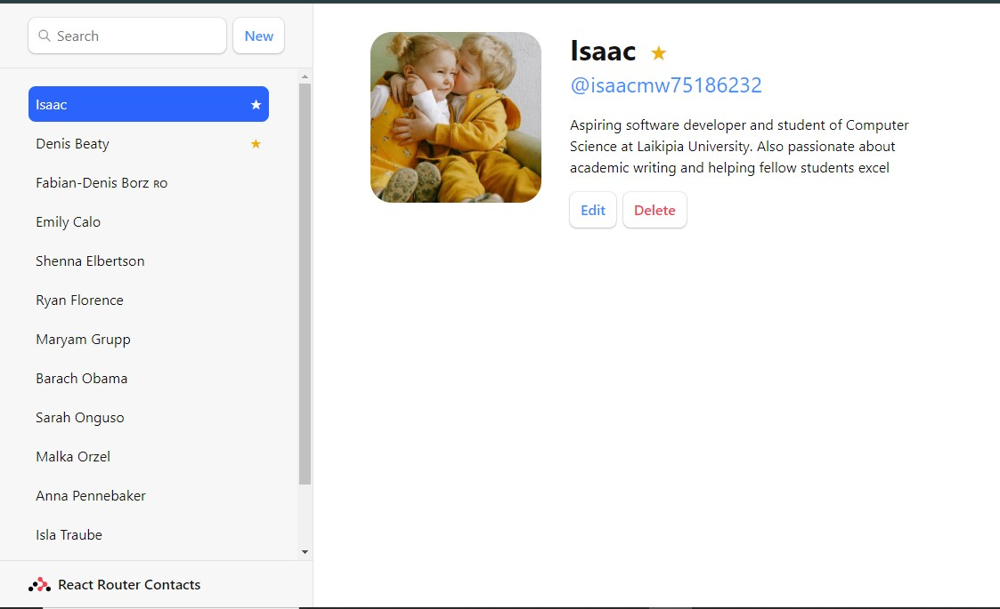

# Contacts Application

This is a simple Contacts application built with React Router that allows users to manage their contacts. Users can view a list of contacts, search for specific contacts, add new contacts, edit existing contacts, mark contacts as favorites, and delete contacts.

## Features

- **View Contacts**: Browse through a list of contacts with their names and details.
- **Search Contacts**: Use the search bar to find contacts by name.
- **Add Contact**: Add a new contact with a form.
- **Edit Contact**: Update contact details including name, Twitter handle, avatar URL, and notes.
- **Favorite Contacts**: Mark contacts as favorites.
- **Delete Contact**: Remove contacts from the list.

## Installation

1. Clone the repository: `git clone https://github.com/your-username/contacts-app.git`
2. Navigate to the project directory: `cd contacts-app`
3. Install dependencies: `npm install`

## Usage

1. Start the development server: `npm start`
2. Open your browser and go to `http://localhost:3000` to view the app.

## Technologies Used

- React
- React Router
- JavaScript (ES6+)
- CSS

## Contributing

Contributions are welcome! Please fork the repository and submit a pull request with your changes.

